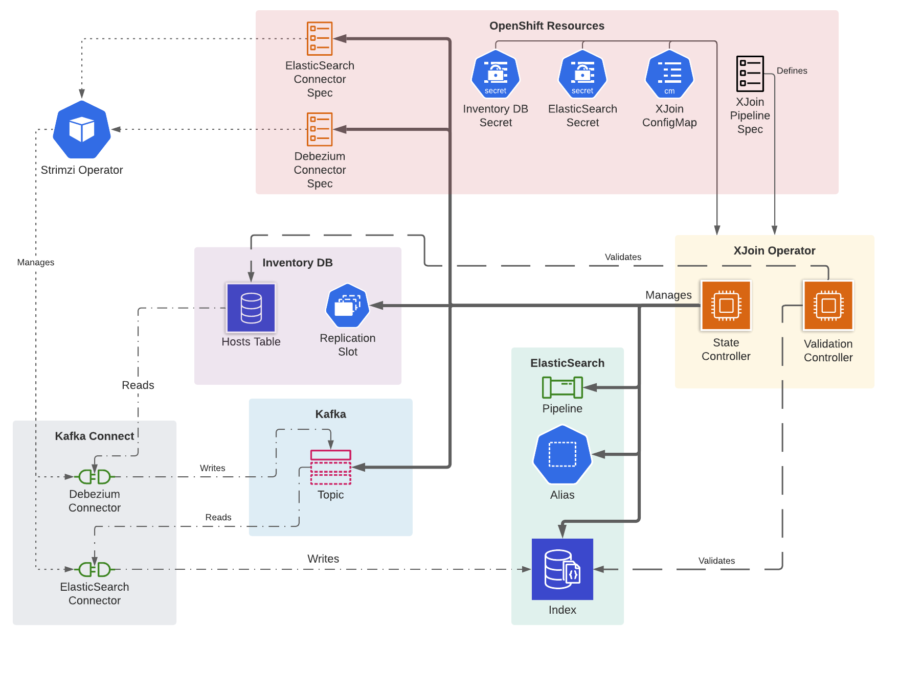

XJoin (Cross Join) Operator
==============

Openshift operator that manages the [XJoin pipeline](https://clouddot.pages.redhat.com/docs/dev/services/xjoin.html).
It currently manages the M2 version of XJoin,
i.e. it maintains the replication pipeline between HBI and ElasticSearch.
Modifications will be necessary to support M3 (joining data between applications).

A XJoin pipeline is defined by the
[XJoinPipeline custom resource](./config/crd/bases/xjoin.cloud.redhat.com_xjoinpipelines.yaml).
It indexes the hosts table of the HBI database into an ElasticSearch index.
A Debezium Kafka Connector is used to read from the HBI database's replication slot.
An ElasticSearch connector is used to index the hosts.
Kafka Connect transformations are performed on the ElasticSearch connector to prepare the host records to be indexed.
An ElasticSearch pipeline is used to transform the JSON fields on a host prior to being indexed.



The operator is responsible for:

- management of an ElasticSearch index, alias, and pipeline
- management of Debezium (source) and ElasticSearch (sink) connectors in a Kafka Connect cluster (using Strimzi)
- management of a Kafka Topic in a Kafka cluster (using Strimzi)
- management of the HBI replication slot. The Debezium connector should manage this. The operator ensures there are no
  orphaned replication slots.
- periodic validation of the indexed data
- automated recovery (e.g. when the data becomes out-of sync)

## Implementation

The operator defines two controllers that reconcile a XJoinPipeline
* [PipelineController](./controllers/xjoinpipeline_controller.go) which manages all the resources
  (connectors, elasticsearch resources, topic, replication slots) and handles recovery
* [ValidationController](./controllers/validation_controller.go) which periodically compares the data in the
  ElasticSearch index with what is stored in HBI to determine whether the pipeline is valid

## Development
### Setting up the development environment

1. Download and unpack [CodeReady Containers](https://developers.redhat.com/products/codeready-containers/overview). Any other Kubernetes cluster should work although they haven't been tested.

1. Append the following line into `/etc/hosts`
    ```
    127.0.0.1 inventory-db xjoin-elasticsearch-es-default
    ```
   
1. Configure CRC to use 16G of memory
    ```
    ./crc config set memory 16384
    ```

1. Start CRC
    ```
    ./crc start
    ```

1. When prompted for a pull secret paste it (you obtained pull secret on step 1 when downloading CRC)

1. Log in to the cluster as kubeadmin (oc login -u kubeadmin -p ...)
   You'll find the exact command to use in the CRC startup log

1. Log in to https://quay.io/
   From Account settings download a kubernetes secret.
   This secret is used to pull quay.io/cloudservices images

1. Run the setup script. <pull-secret-name> is the value of the `metadata.name` field in the quay.io secret file.
    ```
    dev/setup.sh <pull-secret-name> <pull-secret-file-location>
    ```
   
1. Forward ports to ElasticSearch, the HBI DB, and Kafka Connect:
    ```
    dev/forward-ports.sh
    ```
   
### Reset the development environment
The Openshift environment can be deleted with this script:
```
dev/teardown.sh
```

Afterwards, the environment can be setup again without restarting CRC via `dev/setup.sh <pull-secret-name> <pull-secret-file-location>`.
   
### Running the operator locally

With the cluster set up it is now possible to install manifests and run the operator locally.

1. Install CRDs
    ```
    make install
    ```

1. Run the operator
    ```
    make run ENABLE_WEBHOOKS=false
    ```

1. Finally, create a new pipeline
    ```
    oc apply -f ../config/samples/xjoin_v1alpha1_xjoinpipeline.yaml
    ```

There is also `make delve` to debug the operator. After starting the Delve server process, connect to it with a Delve debugger.

### Running the operator locally via OLM

This is useful when testing deployment related changes. It's a little cumbersome for everyday development because an 
image needs to be built by app-interface and pushed to the cluster for each change.

- To deploy the operator via locally OLM run
```bash
./dev/install.operator.locally.sh
```

- To uninstall the OLM deployed operator run
```bash
./dev/uninstall.operator.locally.sh
```

### Running the operator locally via OLM using operator-sdk run bundle

This is more convenient than using the app-interface build because the build is done locally then pushed to quay.io.
[More info](https://sdk.operatorframework.io/docs/olm-integration/testing-deployment)

```bash
docker login -u=$QUAY_USERNAME -p $QUAY_PASSWORD
./dev/install.operator.with.operator.sdk.sh
```

`./dev/uninstall.operator.with.operator.sdk.sh` to uninstall.

### Running tests

- The tests require an initialized Kubernetes environment. See [Setting up the development environment](#development).
- They can be executed via `make test`.
- There is also `make delve-test` to run the tests in debug mode. Then `delve` can be used to connect to the test run.
- The tests take a while to run. To run whitelist one or a few tests, prepend `It` with an F. e.g. change `It("Creates a connector...` to `FIt("Creates a connector...) {`
- Sometimes when the test execution fails unexpectedly it will leave orphaned projects in kubernetes. Use `dev/cleanup.projects.sh` to remove them.